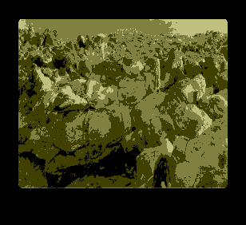

# Hand Editing Guide

Edit `index.html` directly if you want to avoid opening Twine.

## Card Data

Look for `setup.adventureData` near the top of `index.html`.

Each card has:

- `choice`: link text shown to the player.
- `passage`: optional unique passage name, useful when two cards share the same `choice`.
- `action`, `interest`, `self`: score changes.
- `text1`: description shown under the choice and in the opponent choice text.

## Card Images

Each card passage is intentionally small:

```twine
<<include "PlayCardStart">>

<div style="text-align:center; margin:20px;">
  
</div>

<i><<print _caption>></i>

<<include "PlayCardFinish">>
```

Change the `src` value in the `` tag to swap card art. Put new images in the `images` folder.

## Game Rules

The shared turn logic lives in `PlayCardStart` and `PlayCardFinish`. Edit those only when you want to change the rules for drawing, scoring, opponent choice, or ending the game.

## Adding A Card

1. Add a new object to `setup.adventureData`.
2. Add a new passage with the same name as `choice`.
3. If the `choice` text is reused by another card, give the new card a unique `passage` value and name the passage after that.
4. In the new passage, include `PlayCardStart`, add the static image/caption block, then include `PlayCardFinish`.

## Assets

Keep these folders next to `index.html`:

- `images/`
- `audio/`

The opening music uses `audio/fusco.wav`.
